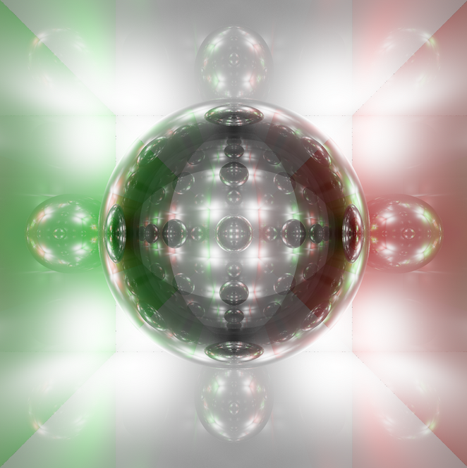

# RayTracer

This project is a CPU based Raytracer, takes as input a .json describing a scene and either output a .ppm image file or open a window showing the result of the raytracing computations. Our philosophy in the project developement is to give  to the user a maximum of control over the output, witch lead to more stylized renders instead of a more realistc apporch.

### Context

RayTracer is the one of the last project of our second academic year at Epitech.
We got the task to make a raytracer within 5 weeks and in a team of up 4 to people.
We are proud to say that this project is the Major project at Paris Epitech in 2023.
For all the members of the project this is the first project made in Rust, so expect lots of non idiomatic patterns. The large number of features has been made possible by an intense crunch that has lead to a limited project structure.

### Examples

Look at the [Renders folder](./renders/) to discover examples of what our Raytracer could create.





### Features

Here are the features implemented from the list of features presented in the project rate chart:

- Sphere
- Drop shadows
- Limited cylinder
- Limited cone
- Torus
- Triangles
- .OBJ file
- Scale
- Scene graph
- Multiple directional lights
- Multiple point lights
- Colored light
- Phong reflection model
- Transparency
- Refraction
- Reflection
- Texturing from file
- Texturing from procedural generation of chessboard
- Texturing from procedural generation of Perlin noise
- Import a scene in a scene
- Set up antialiasing through supersampling
- Set up antialiasing through adaptative supersampling
- Multithreading
- Display the image during and after generation
- Exit during or after generation
- Scene preview using a basic and fast renderer
- Automatic reload of the scene at file change

But most importantly, functionalities going beyond the scope of the project:

- Global illumination
- AutoCompleting .JSON configuration files
- Soft shadows
- Control interface
- Low resolution fast renderer
- Roughness to give materials Metallic to Plastic aspects
- Camera control inside the graphical renderer
- Image buffer to decrees noise and impact of randomness on the image
- Color balance
- Alternative rendering to display point position/normals/camera orientation

### Quick Setup

Require [Rust](https://www.rust-lang.org/tools/install) and Cargo

```bash
// Either

cargo build --release
mv ./target/release/raytracer .
./raytracer [...]

// Or

cargo run --release -- [...]
```

### Usage

Access the program usage:

```
$> ./raytracer --help
```
```
USAGE: ./rustracer [OPTIONS]

OPTIONS:
        --help                  Display this help
        -j <JSON_FILE>          Specify the config file
        -s <PPM_FILE>           Specify the save file
        -w <WIDTH>              Specify the width of the image
        -h <HEIGHT>             Specify the height of the image
        --graphic               Display the image in a live graphic mode
        --layout                Display the layout
        -f <FAST MODE>          Display the image with reduce quality


                +----------------+

<JSON_FILE>: The file must be a valid JSON file
<PPM_FILE>: The file must be a valid PPM file
<WIDTH>: The width must be a positive integer
<HEIGHT>: The height must be a positive integer
<FAST MODE>: The fast mode must be a positive integer


                +----------------+
                | Default values |
+--------------------------------]
| Config:
|       width:          960
|       height:         540
|
|       save_file:      scene_example.ppm
|       config_file:    examples/example.json
|
|       graphic:        false
|       layout:         false
|       fast_mode:      0
+----------------------------------------------]
```

## Test and benchmarks

To test learn more about tests and benchmarks in rust, really basic tests and benchmarks have been added

```
cargo test
cargo bench --bench frame -- --quick
```

## Authors

- [Axel Denis](https://github.com/axel-denis)
- [Auguste Frater](https://github.com/augustefrater)
- [Tom Bariteau Peter](https://github.com/Tomi-Tom)
- [Arthur Aillet](https://github.com/Arthur-Aillet)

## Contributing

Contributions are always welcome!
The school year being over, the project sees its development completed, despite several limitations in the project.
